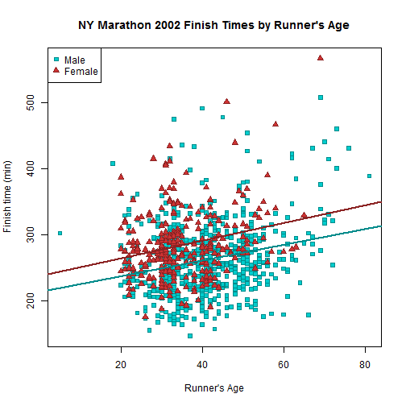

## Practically All Ages Are Represented

Although the overall trend to slower race times with increased age is evident, what is even more striking is the broad range of performance at each cohort.

---

## NYMviz: A Statistical Appreciation of the Marathon

NYMviz will allow the user to interact with several views of the 2002 New York Marathon results to reveal visualizations of the distributions of finish times within the entire sample as well as by gender and age.

By engaging the user to activate various views of the dataset, NYMviz will create a stronger impression of the major features of the dataset than could be achieved by a static presentation of plots and tables alone.

It is our hope that NYMviz will convey the unique hybrid nature of major marathon events as elite athletic competitions (led by a handful of world-class runners) that are also mass celebrations of an active lifestyle that provide aspirational opportunities for everyone.

## It may even inspire someone to get out and run!
